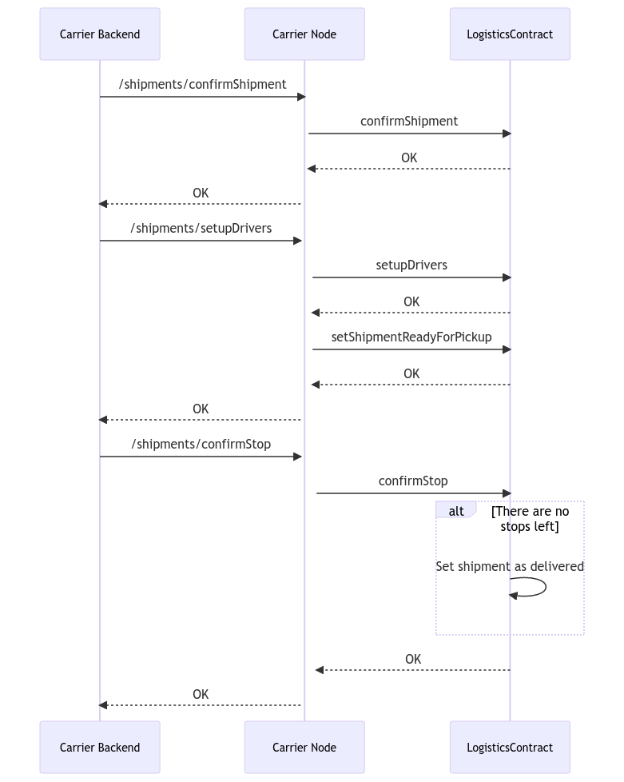

# Tracking Shipments

After the negotiation phase is completed, FTL & LTL shipments follow the same process, where the carrier will update the stages of the shipment until the load is delivered.

1. The first action the carrier must do, is confirming the shipment.  As the shipment information is posted on-chain by the shipper, a double confirmation is required. View: [shipments-confirmshipment.md](shipments-confirmshipment.md "mention")
2. After a shipment is confirmed, now the carrier must setup the drivers.  Drivers are the responsible users for update the currentStops of the shipment.  It is very common to setup the drivers as the carrier itself, so the same user that is managing the load can update the status. View: [shipments-setupdrivers.md](shipments-setupdrivers.md "mention")
3. After drivers are setup, the shipment is now ready for pickup, and every stop can be updated until delivered, View:  [shipments-setupdrivers-1.md](shipments-setupdrivers-1.md "mention")
4. After all stops are completed, the shipment is now delivered, and depending of the shipment service type and payment terms, the payment will be handled that.

<figure><figcaption></figcaption></figure>
