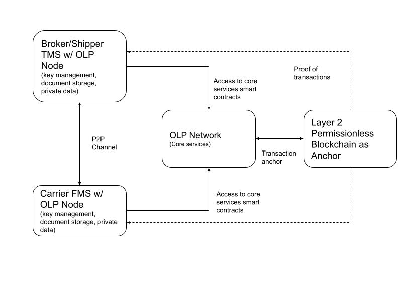

# OLP Architecture

## OLP Tech Stack

LAYER 1: ETHEREUM VIRTUAL MACHINE

The Ethereum Virtual Machine (EVM) is the runtime environment for smart contracts in OLP. All smart contracts and state changes on the OLP  are executed by transactions. The EVM handles all of the transaction processing on the OLP network.
As with any virtual machine, the EVM creates a level of abstraction between the executing code and the executing machine (an OLP node). The EVM will run on OLP nodes.
Under the hood, the EVM uses a set of opcode instructions to execute specific tasks. These (140 unique) opcodes allow the EVM to be Turing-complete, which means the EVM is able to compute just about anything, given enough resources.

LEVEL 2: SMART CONTRACTS

Smart contracts are the executable programs that run on the OLP blockchain.
Not only do smart contracts serve as open source libraries, they are essentially open API services that are always running and can't be taken down. Smart contracts provide public functions which users and applications  may interact with, without needing permission. Any application may integrate with deployed smart contracts to compose functionality. Additionally, any node operators can deploy new smart contracts to OLP in order to add custom functionality to meet their application's needs.

LEVEL 3: OLP NODES

In order for an application to interact with the OLP blockchain, it must connect to an OLP node. Connecting to a node allows you to read blockchain data and/or send transactions to the network.
OLP nodes are computers running software - an OLP client. A client is an implementation of OLP that verifies all transactions in each block, keeping the network secure and the data accurate. The nodes collectively store the state of the OLP blockchain and reach consensus on transactions to mutate the blockchain state.
By connecting your application to an OLP node (via the JSON-RPC API), your application is able to read data from the blockchain (such as user account balances) as well as broadcast new transactions to the network. 

LEVEL 4: OLP CLIENT APIs

Many convenience libraries allow your applications to connect to and communicate with the OLP blockchain.
If your user-facing application is a web app, you may choose to npm install a JavaScript API directly in your frontend. Or perhaps you'll choose to implement this functionality server-side, using a Python or Java API.
While these APIs are not a necessary piece of the stack, they abstract away much of the complexity of interacting directly with an OLP node. They also provide utility functions so as a developer you can spend less time dealing with the intricacies of OLP clients and more time focused on the functionality specific to your application.

LEVEL 5: END-USER APPLICATIONS

At the top level of the stack are user-facing applications. These are the standard applications you regularly use and build today: primarily web and mobile apps. The way you develop these user interfaces remains essentially unchanged. Often users will not need to know the application they're using is built using a blockchain.

## Core Services Architecture

Core services represent foundational elements that the protocol enables applications and business cases mentioned previously. We deem core services as essential functions, very much like an operating system, for the network participants to operate on. The core services provides the participants a neutral and unbiased playground for the participants to perform businesses via applications built. 
Please note that the protocol may add more services as it evolves over time. Also, the actual implementation of the services may differ from originally planned. 
In OLP, core services are nothing but smart contracts deployed in the OLP network. A draft list of core services are described in:
[Core Services](overview/coreservices.md) 

Other physical components of the network include peer to peer nodes that clients run on top of their existing ERP solution or a separate application provided to the participants by a third party. These nodes exchange information with transacting clients to share pricing, bids, documents, sign contracts, and issue payments. However, these nodes need the support of an underlying blockchain to persistently verify identities (ID verification) of other clients before and during transactions. The ID then ties to the transacting clients on chain reputation because parties may decide to transact only with reputable companies (e.g., carriers whose operating authority have not lapsed). 
 
The side chain or Layer 2 is optional however it serves an important interim purpose to “host” several core services related smart contracts such that the nodes receive transaction confirmations much quicker than using public permissionless blockchain such as Ethereum. The side chain is anchored to Ethereum or Bitcoin at predefined intervals using trusted relays. 

## Example Workflow

The image below shows how two OLP nodes run by a broker's TMS interacts with a carriers FMS via their independent nodes and uses core services deployed on the OLP network. 

A broker enters FTL shipment information to receive quotes from carriers on its TMS.

The TMS POSTs quote request to its OLP node.

OLP node starts a Lookup of participants for quote requests through the P2P using the master registry.

OLP node broadcast request to all the carrier nodes online and awaits a response.

A carrier's FMS node receives the request.

The carrier's FMS sends the rates via its OLP node to the TMS's OLP Node.

The TMS presents the rates to the broker.

If the broker selects a quote from the carrier, the TMS will send the book request to the carrier's OLP Node with the originator DID. 

In this example, both participants (broker and carrier) uses core services - to verify each other's identity, execute booking. 

